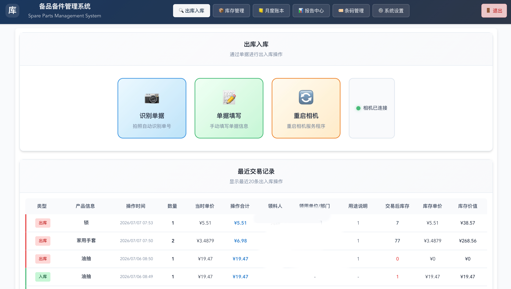
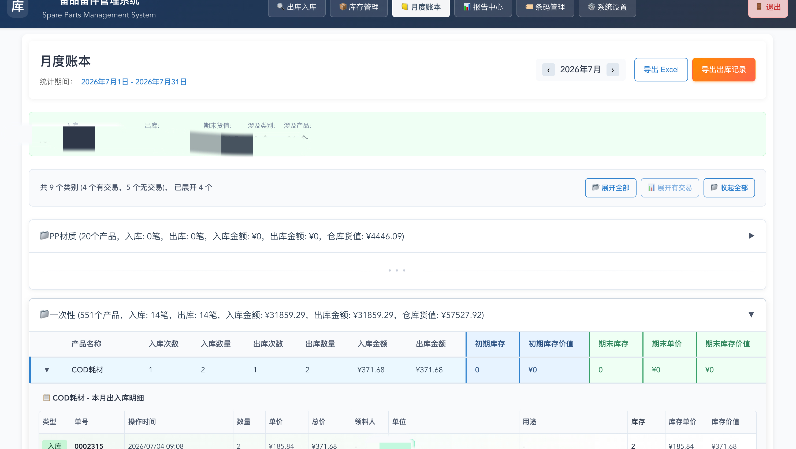

# SmallWareHouseManageSys

小型仓库管理系统，支持库存管理、条码扫描、OCR 单据识别、出入库流水、月度账本、Excel 导出和部署运维。

## 预览

### 出入库操作



### 月度账本



## Features

- Vue 3 + Vite + Pinia 前端，覆盖库存、单据、报表、系统设置等业务页面
- Node.js + Express + SQLite 后端，提供认证、商品、交易、账本、备份恢复等 API
- Windows 相机客户端通过 OpenCV/Flask 采集单据图片，并上传后端进行 OCR 识别
- 支持条码生成与扫描、库存预警、月度快照、成本核算和多种 Excel 报表导出
- 提供 Docker Compose 与 systemd + Nginx 两种部署参考

## Quick Start

```bash
npm run install:all
cp .env.example server/.env
npm run dev:server
npm run dev:client
```

前端默认运行在 `http://localhost:5715`，后端默认运行在 `http://localhost:3003`。

## Configuration

仓库只保留示例配置。部署前请复制 `.env.example` 并填写本地值：

- `JWT_SECRET`
- `INIT_ADMIN_PASSWORD`
- `RUNTIME_DATA_DIR`
- `DB_PATH`
- `UPLOAD_DIR`
- `BACKUP_DIR`
- `OCR_SERVER_URL`

Windows 相机客户端配置位于 `仓库领料单OCR相机客户端/windows_client_local_ocr/config.json`，公开仓库中仅保留 localhost 示例。

## Privacy

以下内容已通过 `.gitignore` 排除，不应提交到 Git：

- `.env`、`client/.env`、`server/.env`
- `node_modules/`、`client/dist/`
- SQLite 数据库、上传文件、运行数据和备份文件
- 本地相机归档、临时文件和压缩包

## Tech Stack

- Frontend: Vue 3, Vite, Pinia, Axios, Chart.js
- Backend: Node.js, Express, SQLite, JWT, bcrypt
- OCR/Camera: Python, OpenCV, Flask, RapidOCR/PaddleOCR
- Deployment: Docker Compose, Nginx, systemd
